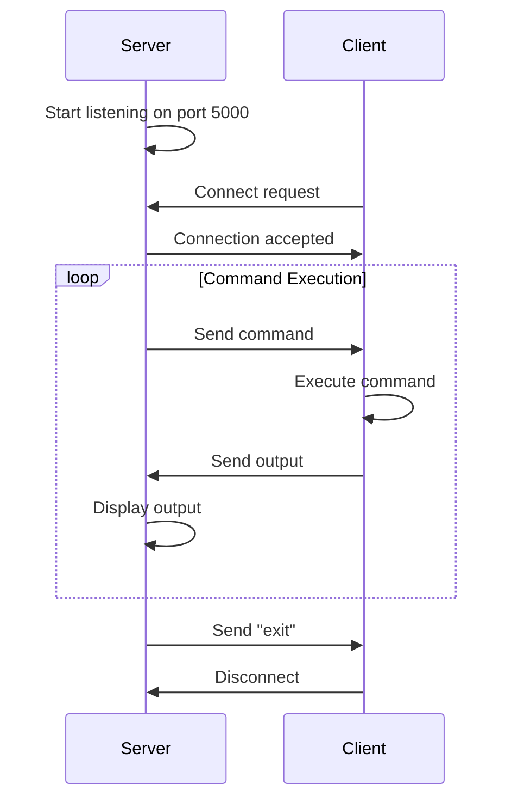

<div align="center">

# 🖥️ Remote Administration Tool

[](https://www.python.org/downloads/)
[](LICENSE)
[](https://github.com/palnirupam/Remote-admin-tool)

**A lightweight TCP-based remote administration tool built with Python for educational purposes**

[Features](#-features) • [Installation](#-installation) • [Usage](#-usage) • [Documentation](#-documentation) • [Security](#-securitywarning)

</div>

---

## 📋 Overview

Remote Administration Tool is a simple yet powerful Python-based application that enables remote command execution on client machines through a centralized server. Built using socket programming, it provides both command-line and GUI interfaces for flexible remote system management.

### 🎯 Key Highlights

- **Dual Interface**: Choose between CLI or GUI based on your preference
- **Real-time Execution**: Execute commands and receive instant feedback
- **Auto-reconnection**: Client automatically reconnects if connection drops
- **Cross-platform**: Works on Windows and Linux systems
- **Lightweight**: No heavy dependencies, pure Python implementation

---

## ✨ Features

| Feature | Description |
|---------|-------------|
| 🔌 **TCP Communication** | Reliable client-server architecture using TCP sockets |
| ⚡ **Remote Command Execution** | Execute system commands on remote machines |
| 🖼️ **Enterprise GUI** | Professional Tkinter-based interface with animations |
| 💻 **CLI Interface** | Powerful command-line interface for advanced users |
| 🔄 **Auto-reconnect** | Client automatically attempts reconnection on failure |
| 📊 **Real-time Output** | View command results instantly with syntax highlighting |
| 🛡️ **Error Handling** | Robust error handling and reporting |
| 🎬 **Smooth Animations** | Loading indicators, progress bars, and transitions |
| 📝 **Activity Logging** | Timestamped logs of all actions and events |
| 💾 **Export Results** | Save command output to text files |
| 🎨 **8 Quick Commands** | Pre-configured buttons for common operations |
| ⚙️ **Custom Commands** | Execute any system command via input field |

---

## 🚀 Installation

### Prerequisites

Before you begin, ensure you have the following installed:

- **Python 3.x** or higher
- **Network connectivity** between server and client machines
- **Firewall access** for port 5000 (or your chosen port)

### Step 1: Clone the Repository

```bash
git clone https://github.com/palnirupam/Remote-admin-tool.git
cd Remote-admin-tool
```

### Step 2: Verify Python Installation

```bash
python --version
# Output should show: Python 3.x.x
```

### Step 3: No Additional Dependencies Required! 🎉

This project uses only Python standard libraries, so no `pip install` needed.

---

## ⚙️ Configuration

### Configure Client Connection

1. Open `client.py` in your text editor
2. Locate the `SERVER_IP` variable:
   ```python
   SERVER_IP = "127.0.0.1"  # Change this
   ```
3. Update with your server's IP address:
   - **Local testing**: `"127.0.0.1"`
   - **Same network**: `"192.168.1.100"` (your server's local IP)
   - **Remote**: Your server's public IP address

4. (Optional) Change the port if needed:
   ```python
   PORT = 5000  # Default port
   ```

### Firewall Configuration

**Windows:**
```powershell
# Allow inbound connections on port 5000
netsh advfirewall firewall add rule name="Remote Admin Tool" dir=in action=allow protocol=TCP localport=5000
```

**Linux:**
```bash
# Using UFW
sudo ufw allow 5000/tcp

# Using iptables
sudo iptables -A INPUT -p tcp --dport 5000 -j ACCEPT
```

---

## 💡 Usage

### Option 1: Command-Line Interface (CLI)

Perfect for advanced users who prefer terminal-based control.

#### Start the Server

```bash
python server.py
```

**Expected output:**
```
Server started...
```

#### Start the Client

On the client machine (or another terminal for local testing):

```bash
python client.py
```

**Expected output:**
```
Connected to server
```

#### Execute Commands

On the server terminal, type any system command:

**Windows Examples:**
```bash
ipconfig          # Network configuration
whoami            # Current user
dir               # List files
systeminfo        # System information
tasklist          # Running processes
exit              # Disconnect client
```

**Linux Examples:**
```bash
ifconfig          # Network configuration
whoami            # Current user
ls -la            # List files
uname -a          # System information
ps aux            # Running processes
exit              # Disconnect client
```

---

### Option 2: GUI Interface

Perfect for users who prefer a visual interface.

#### Start the GUI Server

```bash
python server_gui.py
```

A professional enterprise-grade window will open featuring:

- **Blue header bar** with application title and version
- **Connection controls** (Connect/Disconnect buttons)
- **Status bar** with real-time connection indicators
- **Left panel** with 8 color-coded quick command buttons
- **Custom command input** field for any command
- **Main output area** with dark theme and syntax highlighting
- **Activity log** section showing timestamped events
- **Menu bar** with File, Tools, and Help options

#### Connect to Client

1. Click the **"Connect"** button
2. Status will show: `Waiting for client...`
3. On the client machine, run:
   ```bash
   python client.py
   ```
4. Once connected, status updates to: `Connected: <client_ip>`

#### Use Predefined Commands

The GUI includes 8 quick command buttons with professional icons and color coding:

| Button | Command | Description | Icon |
|--------|---------|-------------|------|
| 🌐 **Network Configuration** | `ipconfig` | Network adapter details and IP addresses | Blue |
| 👤 **Current User Info** | `whoami` | Display current logged-in user | Purple |
| 📁 **Directory Listing** | `dir` | List files and folders in current directory | Orange |
| 💻 **System Information** | `systeminfo` | Detailed system hardware and OS info | Green |
| 📊 **Running Processes** | `tasklist` | List all running processes and PIDs | Cyan |
| 📡 **Network Statistics** | `netstat -an` | Active network connections and ports | Indigo |
| ⚙️ **Environment Variables** | `set` | Display all environment variables | Brown |
| 💾 **Disk Information** | `wmic logicaldisk get name,size,freespace` | Hard drive details and free space | Gray |

#### Custom Command Execution

You can also execute any custom command:

1. Type your command in the "CUSTOM COMMAND" input field
2. Press **Enter** or click **"▶ Execute Command"**
3. View the output in the main display area

**Example custom commands:**
```bash
ping google.com          # Test network connectivity
hostname                 # Get computer name
date /t                  # Display current date
time /t                  # Display current time
ver                      # Windows version
```

#### Additional GUI Features

- **Menu Bar**: File → Save Output, Tools → Clear Output/Logs, Help → About
- **Activity Log**: Real-time log of all actions with timestamps
- **Save Output**: Export command results to a text file
- **Animations**: Smooth loading indicators and progress bars
- **Status Bar**: Live connection status with visual indicators
- **Disconnect Button**: Safely disconnect from client

Command output appears in the dark-themed code editor below with syntax highlighting.

---

## 📖 Documentation

### Project Structure

```
Remote-admin-tool/
│
├── 📄 server.py          # CLI-based server
├── 📄 server_gui.py      # GUI-based server with Tkinter
├── 📄 client.py          # Client that executes commands
└── 📄 README.md          # This documentation
```

### How It Works



### Architecture

1. **Server (`server.py` / `server_gui.py`)**
   - Listens on port 5000
   - Accepts client connections
   - Sends commands to client
   - Receives and displays output

2. **Client (`client.py`)**
   - Connects to server
   - Receives commands
   - Executes using `subprocess`
   - Sends output back to server
   - Auto-reconnects on failure

---

## 🔧 Troubleshooting

### Common Issues and Solutions

#### ❌ Connection Failed

**Problem:** `Connection failed. Retrying in 5 seconds...`

**Solutions:**
- ✅ Verify server is running: `python server.py`
- ✅ Check `SERVER_IP` in `client.py` matches server IP
- ✅ Ensure firewall allows port 5000
- ✅ Test connectivity: `ping <server_ip>`
- ✅ Verify both machines are on the same network (for local testing)

#### ❌ Address Already in Use

**Problem:** `OSError: [Errno 98] Address already in use`

**Solutions:**
- ✅ Port 5000 is occupied by another process
- ✅ Find and kill the process:
  ```bash
  # Windows
  netstat -ano | findstr :5000
  taskkill /PID <process_id> /F
  
  # Linux
  lsof -i :5000
  kill -9 <process_id>
  ```
- ✅ Or change the `PORT` variable in both server and client files

#### ❌ No Output Received

**Problem:** Commands execute but no output appears

**Solutions:**
- ✅ Command may not be valid for the client's OS
- ✅ Try a simple command first: `whoami`
- ✅ Check client terminal for error messages
- ✅ Ensure command produces output (some commands are silent)

#### ❌ GUI Freezes

**Problem:** GUI becomes unresponsive after clicking "Connect"

**Solutions:**
- ✅ This is expected behavior while waiting for client
- ✅ Start the client to complete the connection
- ✅ For production use, implement threading (see Security section)

---

## 🛡️ Security Warning

> ⚠️ **CRITICAL**: This tool is designed for **educational purposes only**. Do NOT use in production environments without implementing proper security measures.

### Current Security Limitations

| Issue | Risk Level | Description |
|-------|------------|-------------|
| 🔓 **No Encryption** | 🔴 Critical | All data transmitted in plain text |
| 🔓 **No Authentication** | 🔴 Critical | Anyone can connect if they know the IP |
| 🔓 **Command Injection** | 🔴 Critical | `shell=True` allows arbitrary command execution |
| 🔓 **No Input Validation** | 🟠 High | Commands are not sanitized |
| 🔓 **No Access Control** | 🟠 High | No permission system |
| 🔓 **No Logging** | 🟡 Medium | No audit trail of executed commands |

### Recommendations for Production Use

If you want to use this in a real environment, implement:

1. **SSL/TLS Encryption**
   ```python
   import ssl
   # Wrap socket with SSL
   ```

2. **Authentication System**
   ```python
   # Add username/password verification
   # Implement token-based authentication
   ```

3. **Input Validation**
   ```python
   # Whitelist allowed commands
   # Sanitize user input
   ```

4. **Secure Command Execution**
   ```python
   # Use shell=False with argument lists
   subprocess.run(['ls', '-la'], shell=False)
   ```

5. **Access Control & Logging**
   ```python
   # Log all commands with timestamps
   # Implement role-based access control
   ```

6. **Consider Established Tools**
   - SSH (Secure Shell)
   - Ansible
   - PowerShell Remoting
   - TeamViewer / AnyDesk

---

## 🎓 Educational Use Cases

This project is perfect for learning:

- ✅ Socket programming in Python
- ✅ Client-server architecture
- ✅ Network communication protocols
- ✅ GUI development with Tkinter
- ✅ Process management with subprocess
- ✅ Error handling and reconnection logic
- ✅ Security considerations in network applications

---

## 🤝 Contributing

Contributions are welcome! Here's how you can help:

1. **Fork** the repository
2. **Create** a feature branch: `git checkout -b feature/AmazingFeature`
3. **Commit** your changes: `git commit -m 'Add some AmazingFeature'`
4. **Push** to the branch: `git push origin feature/AmazingFeature`
5. **Open** a Pull Request

### Ideas for Contributions

- 🔐 Add SSL/TLS encryption
- 🔑 Implement authentication system
- 📝 Add command logging
- 🧵 Implement threading for GUI
- 🎨 Improve GUI design
- 📱 Add mobile client support
- 🐧 Better cross-platform support

---

## 📜 License

This project is licensed under the MIT License - see the [LICENSE](LICENSE) file for details.

---

## 👨‍💻 Author

**Nirupam Pal**

- GitHub: [@palnirupam](https://github.com/palnirupam)
- Repository: [Remote-admin-tool](https://github.com/palnirupam/Remote-admin-tool)

---

## 🙏 Acknowledgments

- Built with Python's standard libraries
- Inspired by the need for simple remote administration tools
- Created for educational and learning purposes

---

## 📞 Support

If you encounter any issues or have questions:

1. Check the [Troubleshooting](#-troubleshooting) section
2. Open an [Issue](https://github.com/palnirupam/Remote-admin-tool/issues)
3. Review existing issues for solutions

---

<div align="center">

**⭐ Star this repository if you find it helpful!**

Made with ❤️ by [Nirupam Pal](https://github.com/palnirupam)

</div>
