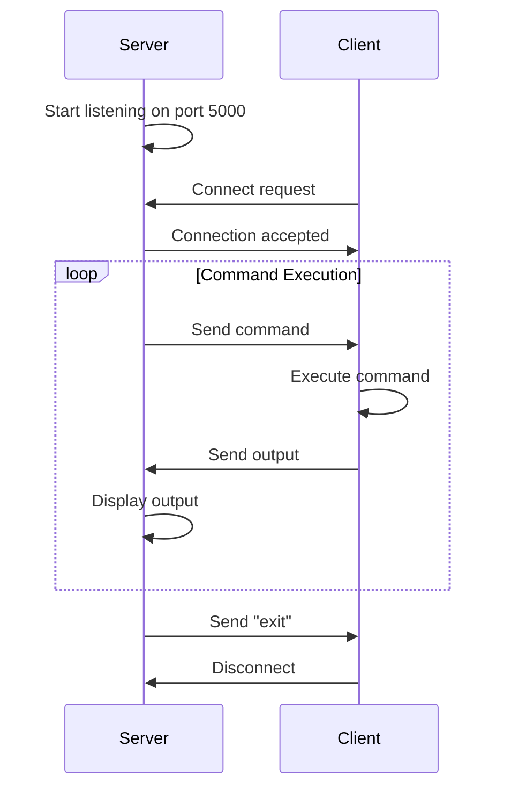

<div align="center">

# 🖥️ Remote Administration Tool

[](https://www.python.org/downloads/)
[](LICENSE)
[](https://github.com/palnirupam/Remote-admin-tool)

**A lightweight TCP-based remote administration tool built with Python for educational purposes**

[Features](#-features) • [Installation](#-installation) • [Usage](#-usage) • [Documentation](#-documentation) • [Security](#security-warning)

</div>

---

## 📋 Overview

Remote Administration Tool is a powerful Python-based application that enables remote command execution on multiple client machines simultaneously through a centralized server. Built using socket programming, it provides both command-line and GUI interfaces for flexible remote system management with advanced features like screenshot capture, file transfer, and real-time monitoring.

### 🎯 Key Highlights

- **Multi-Client Support**: Manage multiple remote machines simultaneously
- **Dual Interface**: Choose between CLI or GUI based on your preference
- **Real-time Execution**: Execute commands and receive instant feedback
- **Advanced Features**: Screenshot capture, file upload/download, system control
- **Interactive Terminal**: Type directly in terminal like a real shell
- **Cross-platform**: Works on Windows and Linux systems
- **Lightweight**: Minimal dependencies, pure Python implementation

---

## ✨ Features

| Feature | Description |
|---------|-------------|
| 🔌 **TCP Communication** | Reliable client-server architecture using TCP sockets |
| 👥 **Multi-Client Support** | Connect and manage multiple clients simultaneously |
| ⚡ **Remote Command Execution** | Execute system commands on remote machines |
| 🖼️ **Enterprise GUI** | Professional Tkinter-based interface with modern design |
| 💻 **CLI Interface** | Powerful command-line interface for advanced users |
| 📸 **Screenshot Capture** | Take screenshots from remote clients |
| 📥 **File Download** | Download files from client machines |
| 📤 **File Upload** | Upload files to client machines |
| ⚙️ **System Control** | Restart, shutdown, or lock remote systems |
| 🎯 **Process Management** | Find and kill processes on remote machines |
| 📊 **Real-time Output** | View command results instantly with syntax highlighting |
| 🛡️ **Error Handling** | Robust error handling and reporting |
| 📝 **Activity Logging** | Timestamped logs of all actions and events |
| 💾 **Export Results** | Save terminal output and logs to files |
| 🎨 **Quick Commands** | Pre-configured buttons for common operations |
| ⌨️ **Interactive Terminal** | Type directly in terminal like a real shell |
| 🖱️ **Scrollable Interface** | Independent scrolling for left panel and terminal |

---

## 🚀 Installation

### Prerequisites

Before you begin, ensure you have the following installed:

- **Python 3.x** or higher
- **Network connectivity** between server and client machines
- **Firewall access** for port 5000 (or your chosen port)

### Step 1: Clone the Repository

```bash
git clone https://github.com/palnirupam/Remote-admin-tool.git
cd Remote-admin-tool
```

### Step 2: Verify Python Installation

```bash
python --version
# Output should show: Python 3.x.x
```

### Step 3: Install Required Dependencies

For GUI with screenshot support:

```bash
pip install pillow
```

**Note:** CLI version (`server.py`) works with Python standard libraries only - no installation needed!

---

## ⚙️ Configuration

### Configure Client Connection

1. Open `client.py` in your text editor
2. Locate the `SERVER_IP` variable:
   ```python
   SERVER_IP = "127.0.0.1"  # Change this
   ```
3. Update with your server's IP address:
   - **Local testing**: `"127.0.0.1"`
   - **Same network**: `"192.168.1.100"` (your server's local IP)
   - **Remote**: Your server's public IP address

4. (Optional) Change the port if needed:
   ```python
   PORT = 5000  # Default port
   ```

### Firewall Configuration

**Windows:**
```powershell
# Allow inbound connections on port 5000
netsh advfirewall firewall add rule name="Remote Admin Tool" dir=in action=allow protocol=TCP localport=5000
```

**Linux:**
```bash
# Using UFW
sudo ufw allow 5000/tcp

# Using iptables
sudo iptables -A INPUT -p tcp --dport 5000 -j ACCEPT
```

---

## 💡 Usage

### Option 1: Command-Line Interface (CLI)

Perfect for advanced users who prefer terminal-based control.

#### Start the Server

```bash
python server.py
```

**Expected output:**
```
Server started...
```

#### Start the Client

On the client machine (or another terminal for local testing):

```bash
python client.py
```

**Expected output:**
```
Connected to server
```

#### Execute Commands

On the server terminal, type any system command:

**Windows Examples:**
```bash
ipconfig          # Network configuration
whoami            # Current user
dir               # List files
systeminfo        # System information
tasklist          # Running processes
exit              # Disconnect client
```

**Linux Examples:**
```bash
ifconfig          # Network configuration
whoami            # Current user
ls -la            # List files
uname -a          # System information
ps aux            # Running processes
exit              # Disconnect client
```

---

### Option 2: GUI Interface (Enterprise Edition)

Perfect for users who prefer a visual interface with advanced features.

#### Start the GUI Server

```bash
python server_gui.py
```

A professional enterprise-grade window will open featuring:

- **Blue header bar** with application title and version
- **Three control buttons**: Start Server, Stop Server, Disconnect Client
- **Status bar** with real-time connection indicators
- **Scrollable left panel** with organized command sections
- **Interactive terminal** - type directly like a real shell
- **Activity log** section showing timestamped events
- **Menu bar** with File, Edit, Tools, and Help options

#### Start Server and Connect Clients

1. Click the **"🚀 Start Server"** button
2. Status will show: `Server listening...`
3. On client machine(s), run:
   ```bash
   python client.py
   ```
4. Clients will appear in the "CONNECTED CLIENTS" list
5. Click on a client to select it (turns green 🟢)
6. Once selected, all command buttons become enabled

#### Multi-Client Management

The GUI supports multiple simultaneous client connections:

- **Client List**: Shows all connected clients with hostname and IP
- **Active Client**: Selected client is marked with 🟢 green indicator
- **Switch Clients**: Click any client in the list to switch active client
- **Auto-Select**: First client is automatically selected on connection

#### Command Sections

**⚡ QUICK COMMANDS** (6 buttons):
| Button | Command | Description |
|--------|---------|-------------|
| 🌐 **Network Info** | `ipconfig` | Network adapter details and IP addresses |
| 👤 **Current User** | `whoami` | Display current logged-in user |
| 📁 **List Files** | `dir` | List files and folders in current directory |
| 💻 **System Info** | `systeminfo` | Detailed system hardware and OS info |
| 📊 **Processes** | `tasklist` | List all running processes and PIDs |
| 📍 **Current Path** | `cd` | Show current working directory |

**🚀 ADVANCED** (3 buttons):
| Button | Function | Description |
|--------|----------|-------------|
| 📸 **Screenshot** | Capture screen | Take screenshot from client and display in popup window |
| 📥 **Download File** | File transfer | Download any file from client machine |
| 📤 **Upload File** | File transfer | Upload any file to client machine |

**⚙️ SYSTEM CONTROL** (3 buttons):
| Button | Command | Description |
|--------|---------|-------------|
| 🔄 **Restart System** | `shutdown /r /t 0` | Restart client machine immediately |
| ⏻ **Shutdown System** | `shutdown /s /t 0` | Shutdown client machine immediately |
| 🔒 **Lock Workstation** | `rundll32.exe user32.dll,LockWorkStation` | Lock client screen |

**🎯 PROCESS CONTROL** (2 buttons):
| Button | Function | Description |
|--------|----------|-------------|
| 🔍 **Find Process** | Search processes | Find process by name (e.g., "notepad") |
| ❌ **Kill Process** | Terminate process | Kill process by name with confirmation |

#### Interactive Terminal

The terminal works like a real shell:

1. **Direct Typing**: Click in the terminal and type commands directly
2. **Command History**: Use ↑↓ arrow keys to navigate previous commands
3. **Auto-Complete**: Press Enter to execute
4. **Prompt Protection**: Cannot delete the "Remote-Admin>" prompt
5. **Syntax Highlighting**: Commands, output, errors shown in different colors

**Example terminal session:**
```
Remote-Admin> whoami
DESKTOP-ABC\User

Remote-Admin> dir
 Volume in drive C is Windows
 Directory of C:\Users\User

Remote-Admin> mkdir test_folder
✓ Command executed successfully
```

#### Screenshot Feature

1. Click **"📸 Screenshot"** button or use menu: Tools → Capture Screenshot
2. Screenshot window opens with the captured image
3. Click **"💾 Save Screenshot"** to save with timestamp
4. Supports PNG and JPEG formats

#### File Transfer

**Download from Client:**
1. Click **"📥 Download File"** button or menu: File → Download from Client
2. Enter full file path on client (e.g., `C:\Users\file.txt`)
3. Choose save location on server
4. File is transferred and saved

**Upload to Client:**
1. Click **"📤 Upload File"** button or menu: File → Upload to Client
2. Select file from server
3. File is uploaded to client's current directory
4. Confirmation message appears in terminal

#### Menu Bar Features

**File Menu:**
- 📥 Download from Client
- 📤 Upload to Client
- 💾 Save Terminal (export terminal output)
- Exit

**Edit Menu:**
- Clear Terminal
- Clear Logs

**Tools Menu:**
- 📸 Capture Screenshot
- 📊 System Info

**Help Menu:**
- About (version and feature information)

---

## 📖 Documentation

### Project Structure

```
Remote-admin-tool/
│
├── 📄 server.py              # CLI-based server (single client)
├── 📄 server_gui.py          # GUI-based server with multi-client support
├── 📄 client.py              # Client with command execution and special features
├── 📄 test_bug_condition.py  # Property-based tests for bug conditions
├── 📄 test_preservation.py   # Property-based tests for behavior preservation
└── 📄 README.md              # This documentation
```

### How It Works



### Architecture

1. **Server (`server.py` / `server_gui.py`)**
   - Listens on port 5000
   - Accepts multiple client connections simultaneously
   - Manages client list and active client selection
   - Sends commands to active client
   - Receives and displays output
   - Handles special commands (SCREENSHOT, DOWNLOAD, UPLOAD, SYSINFO)

2. **Client (`client.py`)**
   - Connects to server
   - Sends system information (hostname, OS, user)
   - Receives commands
   - Executes using `subprocess.run()` with proper error handling
   - Handles special commands:
     - **SCREENSHOT**: Captures screen using PIL/mss
     - **DOWNLOAD:path**: Reads and sends file as base64
     - **UPLOAD:filename:data**: Receives and saves file
     - **SYSINFO**: Sends detailed system information
   - Sends output back to server
   - Auto-reconnects on failure

3. **Communication Protocol**
   - **Client Info**: JSON with hostname, OS, username
   - **Commands**: Plain text strings
   - **Responses**: Plain text or JSON for special commands
   - **File Transfer**: Base64 encoded binary data

---

## 🔧 Troubleshooting

### Common Issues and Solutions

#### ❌ Connection Failed

**Problem:** `Connection failed. Retrying in 5 seconds...`

**Solutions:**
- ✅ Verify server is running: `python server.py`
- ✅ Check `SERVER_IP` in `client.py` matches server IP
- ✅ Ensure firewall allows port 5000
- ✅ Test connectivity: `ping <server_ip>`
- ✅ Verify both machines are on the same network (for local testing)

#### ❌ Address Already in Use

**Problem:** `OSError: [Errno 98] Address already in use`

**Solutions:**
- ✅ Port 5000 is occupied by another process
- ✅ Find and kill the process:
  ```bash
  # Windows
  netstat -ano | findstr :5000
  taskkill /PID <process_id> /F
  
  # Linux
  lsof -i :5000
  kill -9 <process_id>
  ```
- ✅ Or change the `PORT` variable in both server and client files

#### ❌ No Output Received

**Problem:** Commands execute but no output appears

**Solutions:**
- ✅ Some commands don't produce output (mkdir, copy, del, etc.)
- ✅ Check for success message: "✓ Command executed successfully"
- ✅ Command may not be valid for the client's OS
- ✅ Try a simple command first: `whoami`
- ✅ Check Activity Log for execution status
- ✅ Ensure command produces output (dir, ipconfig work well)

#### ❌ Screenshot Not Working

**Problem:** Screenshot button doesn't capture screen

**Solutions:**
- ✅ Ensure PIL (Pillow) is installed: `pip install pillow`
- ✅ Client needs screenshot libraries (mss or PIL)
- ✅ Check Activity Log for error messages
- ✅ Verify client has display/screen access

#### ❌ File Transfer Fails

**Problem:** Upload/Download doesn't work

**Solutions:**
- ✅ Check file path is correct and accessible
- ✅ Ensure client has read/write permissions
- ✅ Large files may timeout - increase timeout in client.py
- ✅ Check Activity Log for detailed error messages

#### ❌ Buttons Not Visible

**Problem:** System Control or Process Control buttons not showing

**Solutions:**
- ✅ Scroll down in the left panel using mouse wheel
- ✅ Left panel is scrollable - all buttons are there
- ✅ Resize window if too small (minimum 1400x800)

---

## 🛡️ Security Warning

> ⚠️ **CRITICAL**: This tool is designed for **educational purposes only**. Do NOT use in production environments without implementing proper security measures.

### Current Security Limitations

| Issue | Risk Level | Description |
|-------|------------|-------------|
| 🔓 **No Encryption** | 🔴 Critical | All data transmitted in plain text |
| 🔓 **No Authentication** | 🔴 Critical | Anyone can connect if they know the IP |
| 🔓 **Command Injection** | 🔴 Critical | `shell=True` allows arbitrary command execution |
| 🔓 **No Input Validation** | 🟠 High | Commands are not sanitized |
| 🔓 **No Access Control** | 🟠 High | No permission system |
| 🔓 **No Logging** | 🟡 Medium | No audit trail of executed commands |

### Recommendations for Production Use

If you want to use this in a real environment, implement:

1. **SSL/TLS Encryption**
   ```python
   import ssl
   # Wrap socket with SSL
   ```

2. **Authentication System**
   ```python
   # Add username/password verification
   # Implement token-based authentication
   ```

3. **Input Validation**
   ```python
   # Whitelist allowed commands
   # Sanitize user input
   ```

4. **Secure Command Execution**
   ```python
   # Use shell=False with argument lists
   subprocess.run(['ls', '-la'], shell=False)
   ```

5. **Access Control & Logging**
   ```python
   # Log all commands with timestamps
   # Implement role-based access control
   ```

6. **Consider Established Tools**
   - SSH (Secure Shell)
   - Ansible
   - PowerShell Remoting
   - TeamViewer / AnyDesk

---

## 🎓 Educational Use Cases

This project is perfect for learning:

- ✅ Socket programming in Python (TCP client-server)
- ✅ Multi-client connection management
- ✅ Network communication protocols
- ✅ GUI development with Tkinter (Canvas, ScrolledText, custom widgets)
- ✅ Process management with subprocess
- ✅ File I/O and base64 encoding for file transfer
- ✅ Image processing with PIL (screenshot capture)
- ✅ Threading for non-blocking server operations
- ✅ Error handling and reconnection logic
- ✅ Property-based testing with Hypothesis
- ✅ Security considerations in network applications

---

## 🤝 Contributing

Contributions are welcome! Here's how you can help:

1. **Fork** the repository
2. **Create** a feature branch: `git checkout -b feature/AmazingFeature`
3. **Commit** your changes: `git commit -m 'Add some AmazingFeature'`
4. **Push** to the branch: `git push origin feature/AmazingFeature`
5. **Open** a Pull Request

### Ideas for Contributions

- 🔐 Add SSL/TLS encryption
- 🔑 Implement authentication system
- 📝 Add command logging to database
- 🎨 Add dark/light theme toggle
- 📱 Add web-based client interface
- 🐧 Better cross-platform support (macOS)
- 🔔 Add notification system for events
- 📊 Add performance monitoring dashboard
- 🗂️ Add file browser for easier file management
- 🔍 Add search functionality in terminal output

---

## 📜 License

This project is licensed under the MIT License - see the [LICENSE](LICENSE) file for details.

---

## 👨‍💻 Author

**Nirupam Pal**

- GitHub: [@palnirupam](https://github.com/palnirupam)
- Repository: [Remote-admin-tool](https://github.com/palnirupam/Remote-admin-tool)

---

## 🙏 Acknowledgments

- Built with Python's standard libraries
- Inspired by the need for simple remote administration tools
- Created for educational and learning purposes

---

## 📞 Support

If you encounter any issues or have questions:

1. Check the [Troubleshooting](#-troubleshooting) section
2. Open an [Issue](https://github.com/palnirupam/Remote-admin-tool/issues)
3. Review existing issues for solutions

---

<div align="center">

**⭐ Star this repository if you find it helpful!**

Made with ❤️ by [Nirupam Pal](https://github.com/palnirupam)

</div>
